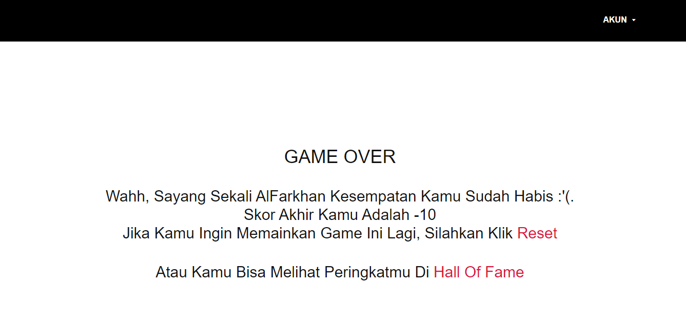

# **Game Penjumlahan Berbasis Web | By AlFarkhan - K3519006**
## Introduction : http://gemath.infinityfreeapp.com/
  [Website ini](http://gemath.infinityfreeapp.com/) ini menyajikan sebuah permainan matematika berupa menjumlahkan 2 bilangan acak, mulai dari bilangan 0 hingga 20. 
  Di dalam game ini juga tersedia fiture Hall Of Fame yang berguna untuk melihat 10 user dengan skor tertinggi  
  
## Documentation
### 1. Halaman Login

### 2. Halaman Utama

### 3. Game Start

### 4. Game Over

### 5. Halaman Hall Of Fame

# File List
|Nama File|Fungsi|
|--------|-------|
|[img](imgs)|Dokumentasi Screenshot|
|[header.php](header.php)|Script untuk mengatur template header|
|[login.php](login.php)|Script untuk Login ke dalam game|
|[index.php](index.php)|Menampilkan Halaman Utama|
|[gamestart.php](gamestart.php)|Fiture utama website, Game Penjumlahan|
|[halloffame.php](halloffame.php)|Menampilkan 10 Skor Tertinggi|
|[footer.php](footer.php)|Tampilan Footer|
|[func.php](func.php)|Script yang berisi kumpulan function, termasuk database|
|[dtgame.sql](dtgame.sql)|Database yang berisi data-data untuk game ini|
